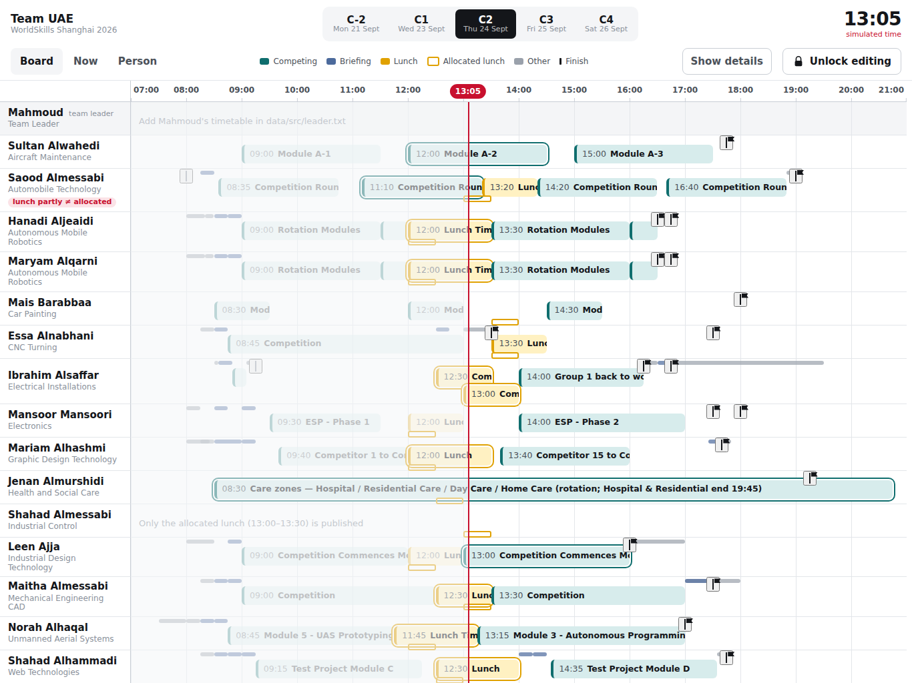
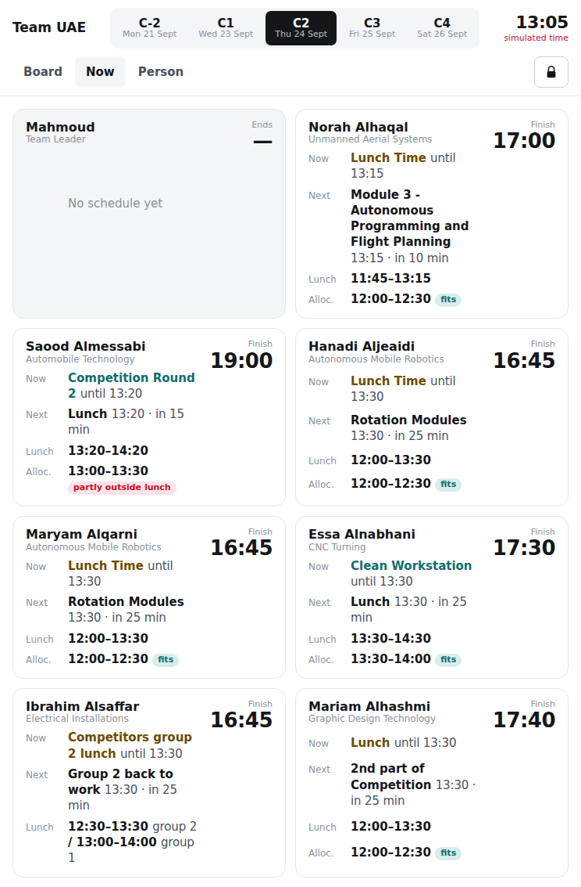
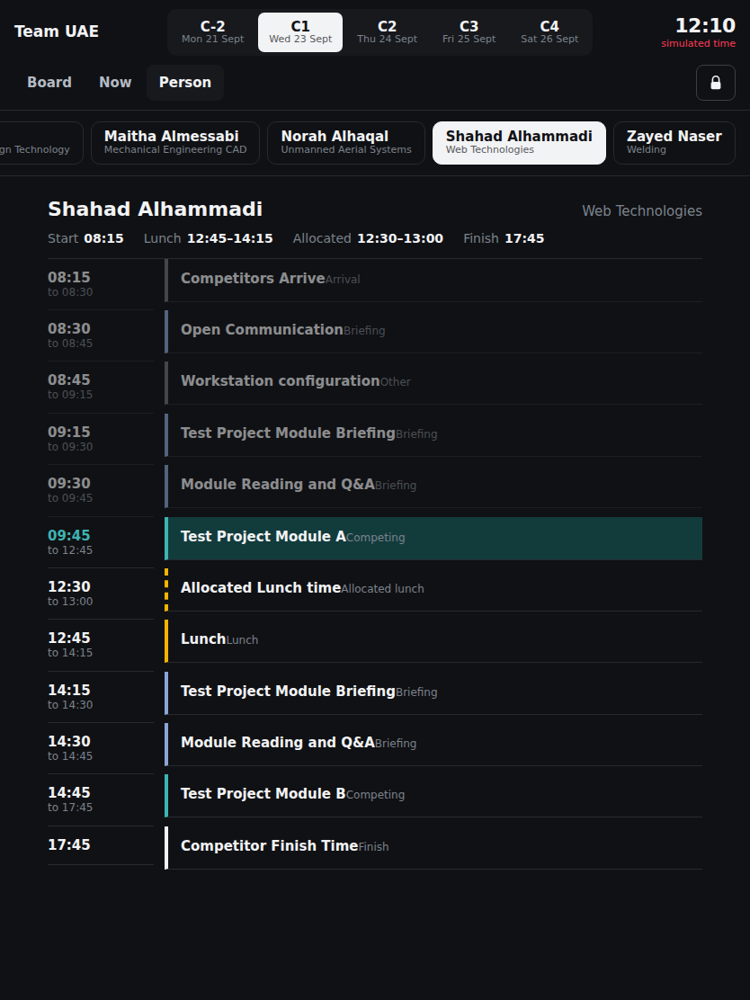
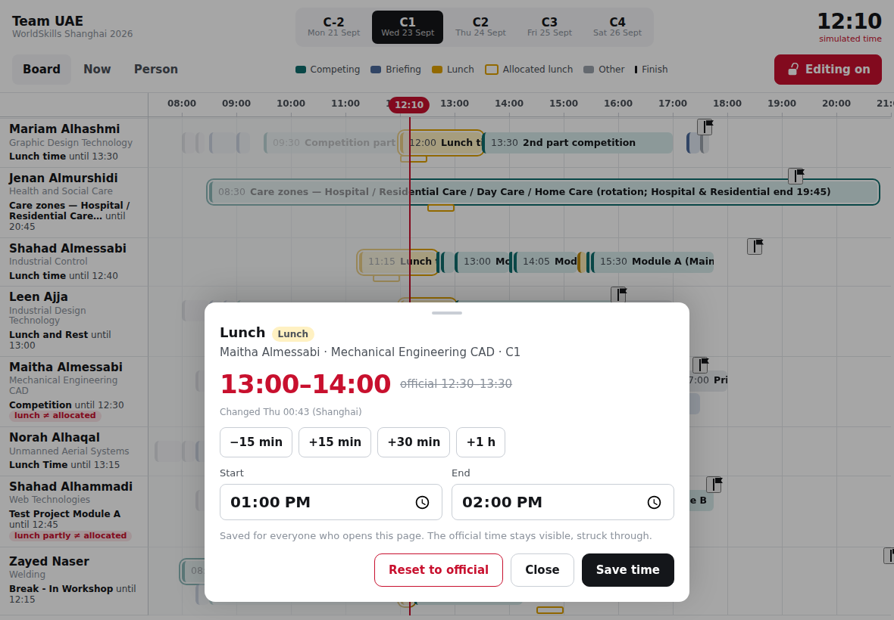

# Team UAE schedule board — WorldSkills Shanghai 2026

A tablet-first web app for the UAE team leader at WorldSkills Shanghai 2026 (21–26 September).
Sixteen competitors, sixteen skills, five days, and every skill runs its own timetable — this board
puts all of them on one iPad screen so the team leader always knows who is competing, who is at
lunch, whether that lunch lines up with the team's allocated slot, and when each competitor finishes.

When the day drifts (a lunch pushed back, a module running late) the change is recorded once and
every device sees it.

Live at **https://mahmoud-schedule.mikkaiser.com** — deliberately hidden from search engines.



## What it shows

**Board** — one row per person on an hour grid. A red line tracks the current Shanghai time and
auto-scrolls into view. Teal blocks are competing time; the solid amber block is the team's
*allocated* lunch slot (when they actually go to the restaurant) and the dashed amber outline is the
skill's own lunch break it has to fit inside, so a mismatch is visible without reading anything.
"Compact" squeezes briefings and admin items into thin ticks so every competitor fits on a 12.9" iPad.

**Now** — a card per person, sorted so whoever changes state soonest is on top: what they are doing,
what comes next and in how many minutes, lunch vs. allocated (`fits` / `partly outside lunch` /
`outside lunch break`), finish time. Made for holding the iPad in portrait while walking the venue.

**Person** — one competitor's whole day, deep-linkable (`/#/C1/person/maitha`) so a student can open
their own.

<p>
  
  
  
</p>

**Live adjustments** — tap the lock, enter the team passcode, tap any block and shift it (quick
−15/+15/+30/+1h buttons or time pickers). The official time stays visible, struck through, with a
"moved" badge. Changes are stored server-side and picked up by every open device within a minute;
"Reset to official" removes them.

Other details that matter on a competition floor:

- It is a PWA: on the iPad open it in Safari, Share → *Add to Home Screen*, and it runs full-screen
  with its own icon. A service worker caches the app and the last schedule, so it opens instantly
  and keeps working when the venue Wi-Fi drops (an "Offline" banner says how old the data is).
  New deploys show a "New version available" bar; tapping it reloads onto the new build.
- Light and dark themes follow the iPad setting.
- `?now=2026-09-23T12:10` in the URL simulates a moment in Shanghai time for rehearsing a day.

## Data

The timetables come from the official *Competitor Timetable Report* PDFs (`schedules/`), transcribed
into plain-text files in [`data/src/`](data/src/) — one per day, `@person-id` blocks, one
`HH:MM-HH:MM Title` line per event. [`meta.json`](data/src/meta.json) holds people and dates,
[`leader.txt`](data/src/leader.txt) the team leader's own timetable.

```bash
node scripts/build-data.js      # data/src/*  ->  data/schedule.json, data/leader.json
node scripts/validate-data.js   # ids, times, references
```

`build-data.js` classifies each event (competing / briefing / lunch / allocated lunch / break /
arrival / leaving / finish / other) from its title, dedupes rows the report repeats, and flags days
where a skill published nothing but the allocated lunch. Two skills (Aircraft Maintenance, Health and
Social Care) list every rotation group; those are merged into one block per slot.

## Running it

```bash
cp .env.example .env            # set EDIT_PASSCODE
docker compose up --build -d    # http://localhost:8080
```

Or without Docker: `npm ci && EDIT_PASSCODE=… node server.js`. Node 20+, the only dependency is
Express. The frontend is plain ES modules — no build step.

Search engines are kept out three ways: `<meta name="robots" content="noindex…">`, `robots.txt`
with `Disallow: /`, and an `X-Robots-Tag` header on every response.

## Deployment

Pushing to `main` runs [`.github/workflows/deploy.yml`](.github/workflows/deploy.yml): it validates
the data and publishes `ghcr.io/mikkaiser/mahmoud-schedule:latest`. The server holds no deploy key
and nothing can push into it — a cron job runs [`deploy.sh`](deploy.sh) every two minutes, which
pulls the image and recreates the container only when it changed.

On the server: [`docker-compose.prod.yml`](docker-compose.prod.yml) runs the published image with no
host port; the reverse proxy reaches it over a dedicated Docker network, terminates TLS, and the
overrides file lives on a bind-mounted volume so it survives redeploys.

## API

| Method | Path | Notes |
|--------|------|-------|
| `GET` | `/api/schedule` | base timetable + leader track |
| `GET` | `/api/overrides` | `{ eventId: { start, end, updatedAt } }` |
| `POST` | `/api/unlock` | `{ passcode }` → 204 / 401 |
| `PUT` | `/api/overrides/:eventId` | `{ start, end }`, header `X-Passcode` |
| `DELETE` | `/api/overrides/:eventId` | header `X-Passcode` |

## Layout

```
server.js               Express: static files, /api, X-Robots-Tag
data/src/               editable timetable sources (the truth)
data/*.json             generated by scripts/build-data.js
public/                 app.js, sw.js, views/{board,now,person,sheet}.js, lib/, styles.css
scripts/                build-data.js, validate-data.js
schedules/              the original PDFs
deploy.sh               pull-based deploy used by the server cron
```
